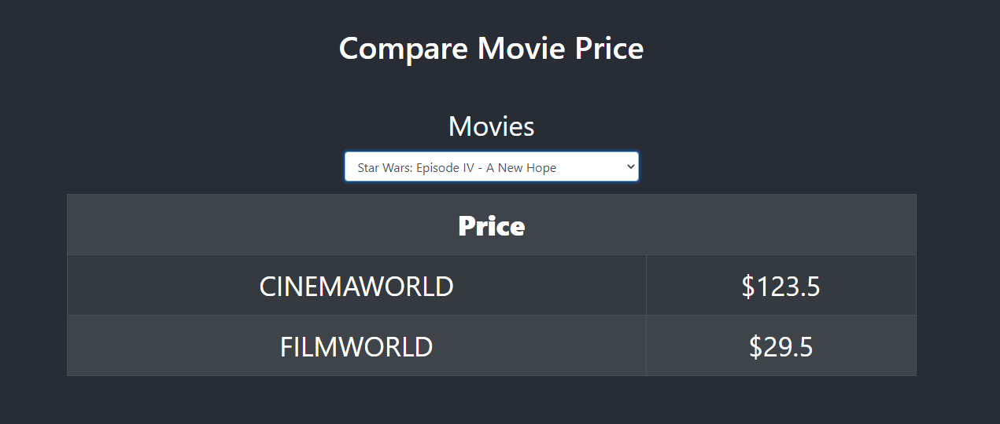

# external-api
This project demonstrates how to use unreliable and slow external API effectively. The project utilises external API to fetch movie names and prices for different cinemas. Users can then use the front end portal to select different movies and visualise different prices from various cinemas.


The application uses the following technologies:
- Backend: Python with Flask
- Frontend: ReactJs 
- Type Checking: Typescript



## Getting Started

Set the following environment variables:
```
-  ACCESS_TOKEN: Webjet API token
-  FLASK_APP: Flask App entry point (set it to server.py)
-  FLASK_ENV: development or production
```
<b>export FLASK_APP=server.py</b><br>
<b>export ACCESS_TOKEN=[Token]</b>
  
build the static code
```
cd ./client
npm install
npm run build
```
The server requires pipenv
run the server
```bash
cd ./server
pip install pipenv
pipenv install
pipenv shell
pipenv run flask run
```

The server runs on port `5000`.

There are three routes:
```
- http://localhost:5000/              - homepage
- http://localhost:5000//api/movies   - accepts GET requests for retrieving all the movie names
- http://localhost:5000/api/movie     - accepts POST requests with cinema names as the keys and the movie id's as the values
                                          e.g. {
                                              "cinemaworld": "cw0080684",
                                              "filmworld": "fw0080684"
                                            }
```

## Scripts

### Server

```
- pipenv run flask run                                    - will start the production server
- pipenv run python -m unittest discover tests            - will run all the tests
```

### Client

```
- npm run build            - will run webpact to generate static content out of jsx and copy the build directory to the client
- npm test                 - will run all the tests
- npm run eject            - will give access to all config files
- npm start                - will start the dev server
```

## Project Structure

### Overall Structure

1. The project is devided in to two main directories. 
2. The `server` directory contains the express server as well as all the helper classes.
3. The `client` directory contains the reactjs Frontend code.

### Server Structure

1. The `server/test` directory contains all the unit and integration tests for the Backend server.
2. The `server/src` directory contains the route handler, the main app.ts and services.
3. The `server/config` directory contains all the site specific configs.
4. The `server/static` directory contains all the static files generated by webpack build.

### Client Structure

1. The `client/src/App.tsx` directory contains the root react component for the Frontend.
2. The `client/src/SelectMovie.tsx` directory contains the functional component for generating the form.
3. The `client/src/PriceTable.tsx` directory contains the functional component for creating the price tables.
4. The `client/src/Errors.tsx` directory contains the functional component for displaying errors.


### Dev Server

To run the development express server and start `nodemon`:

```bash
cd server
export FLASK_ENV=development
pipenv run flask run 
```

To run the development react server:

```bash
cd client
npm start
```

## FAQ

## Credits

Written by Shahriar Hasan Khan
Contact: shahriar27@hotmail.com

